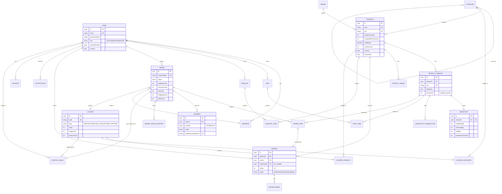

# NEXORA — Entity Relationship Diagram

Renders natively on GitHub (Mermaid). Mirrors `backend/prisma/schema.prisma`
exactly — regenerate this by hand if the schema changes, since there's no
live DB here to auto-diff against.

## Key design decisions

- **`ProductVariant` is the unit of inventory and cart/order lines**, not
  `Product` — even single-variant products get one variant row. This avoids
  a special-cased "does this product have variants?" branch everywhere
  inventory, cart, and orders touch a product.
- **`Inventory` vs `InventoryTransaction`**: `Inventory` is the fast-read
  counter table the storefront checks for stock display; `InventoryTransaction`
  is the append-only ledger that makes reservation/release/sale auditable and
  replayable. Both are updated together inside one DB transaction.
- **Snapshots on `OrderItem`**: `productNameSnapshot`, `variantNameSnapshot`,
  `skuSnapshot`, `unitPriceCents` are copied at order time so a past order's
  displayed price/name never drifts if the product is later edited, repriced,
  or archived.
- **`Review.orderItemId`** is how "verified purchase" is derived structurally
  rather than by a boolean the user can lie about — a review is only linked
  to a specific delivered `OrderItem`, one review per `(productId, userId)`.
